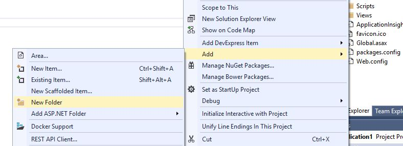
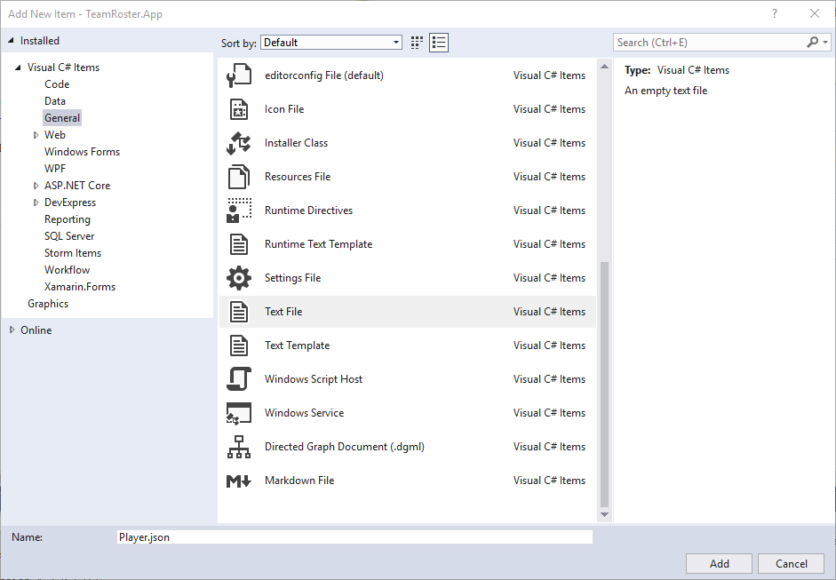
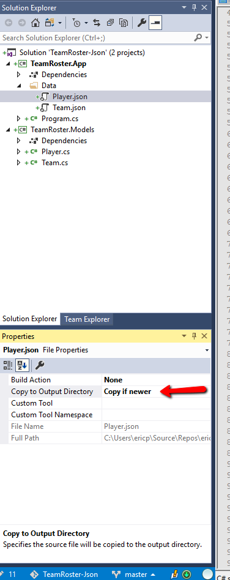

# TeamRoster w/ Json Data
TeamRoster w/ Json Data is a Console app demonstrating treating flat files as a database.

Add a new folder named "Data"

Right-click the new data folder and add two new files (Add->New-Item) to 
hold the data for our classes:

- Player.json
- Team.json

The reason we add these empty files is so we can include the folder in the 
directory with our EXE. Now we need to click on each file and change it's output options in the properties panel.

Since these are going to act as my database I am selecting the 
"Copy if newer" option. This will now cause the Data folder to be included 
alnongside our exe when we run or publish the app.

